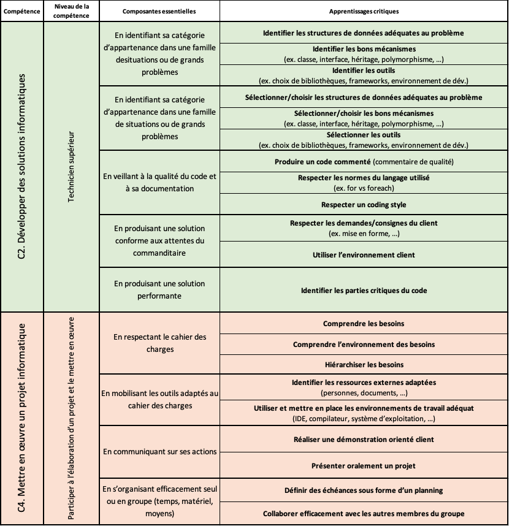

# L2_LOO_Projet_2

## Sujet

Le fil conducteur de ce projet est de réaliser un jeu vidéo en mettant en oeuvre la plupart des connaissances que vous avez acquises dans le module de Java.

Ce jeu sera du type "Scramble" (ou "Scramble Like") :
[-> voir l'original (aller à 2mn : dans les "cavernes") <-](https://www.youtube.com/watch?v=3Vc-RIkpk40)

Si dans l'ensemble le contenu du jeu sera laissé à votre entière discrétion (faîtes quelque chose dont vous serez fiers), il devra néanmoins répondre à un certain nombre de critères à respecter.

De façon paradoxale, réaliser un jeu video n'est pas l'objectif principal du projet. Il s'agira plutôt:

- de développer du code de qualité répondant à un cahier des charges,
- de travailler efficacement en groupe,
- d'appliquer les principes et bonnes pratiques vues en cours,
- de vous amuser.

## Instructions

Le but de ce projet est de réaliser un projet Java complet en mettant en oeuvre la plupart des connaissances que vous avez acquises dans les modules LOO1 et LOO2.

```VOUS DEVREZ METTRE EN OEUVRE EXCLUSIVEMENT LES BONNES PRATIQUES VUES EN COURS.```

À moins d'un accord explicite de ma part, les techniques utilisées devront obligatoirement être tirées des exemples du cours et des corrections que j'ai fournis tout au long de l'année.

Sauf dérogation (au cas par cas), il vous est strictement interdit de copier/coller du code récupéré sur un/des site(s) tiers (github, tutoriels, etc.).

## Organisation

### Groupe

Ce projet sera réalisé en groupe de 3 personnes :

Il sera nécessaire de vous organiser autour de sous-objectifs à atteindre et en définissant des interfaces claires entre chaque partie.

```Chaque membre devra pouvoir avancer en // sur le développement, et il ne doit que rarement y avoir 3 personnes sur la même machine.```

Si chaque membre focalisera sur "sa" partie, tous les membres du groupe doivent être capables d'expliquer l'ensemble du projet.

Il est essentiel de se répartir le travail entre les membres du groupe pour permettre d'avancer sur plusieurs parties en parallèle. Il est encore plus essentiel de d'abord réfléchir sur l'organisation et la structure du code en termes de conception orientée objet.

### Evaluation en continu
L'évaluation du projet sera faire en continu pendant les séances.

```
Toute absence non justifiée pendant les séances de Projet sera sanctionnée par un 0.
Toute absence prolongée entraînera une exclusion du groupe.
```

La grille d'évaluation sera celle des Compétences suivantes :



## Cahier des Charges
Comme indiqué précédemment, l'objectif de réaliser en Java un jeu vidéo du type "Scramble", et plus particulièrement la partie où le vaisseau se déplace dans des carvernes en évitant les paroies et les ennemis.

Voici une liste d'inspirations qui pourront vous guider :

- [Scramble](https://www.youtube.com/watch?v=3Vc-RIkpk40)
- [Gradius](https://www.youtube.com/watch?v=rtjCKk8l9WA)
- [Super Cobra](https://www.youtube.com/watch?v=ajF0Citli8c)
- [Des variantes](https://www.youtube.com/watch?v=XreJLWneUVk)

### Version Minimale (10/20)

- Gameplay : un vaisseau + des montagnes/cavernes, un type d'ennemi, tir unique
- IA/logique : ennemis statiques, trajectoires mono-directionnelles (projectiles et ennemis)
- Graphismes : formes géométriques simples (hitbox), fond fixe (sauf obstacles)
- Level design : 1 niveau
- Audio : rien
- Structure : écran de jeu uniquement (pas de menus)

### Version Intermédiaire (18/20)

- Gameplay : plusieurs types d'ennemis, fusées au sol, bombes
- IA/logique : plusieurs types de trajectoires d'ennemis
- Graphismes : sprites, HUD (par ex., score, points de vie, info dernier ennemi...)
- Level design : plusieurs niveaux
- Audio : musique de fond
- Structure : menus principal, high scores

### Version Maximale (20/20)
- Gameplay : power-ups/items (par ex., plus de tirs, plus de dégâts, fréquence, protection...)
- IA/logique : plusieurs types de trajectoires de tirs (par ex., éventail, laser, en cercle, ..)
- Graphismes : fond en scrolling/parallax
- Level design : boss de fin de niveau
- Audio : effets sonores
- Structure : plus de menus (par ex. options, pause, level select, …)

## Ressources

### LibGDX

Ce projet utilise le framework [LibGDX](https://libgdx.com) qui est dédié à la création de jeux en Java.

Pour le prendre en main, je vous invite à suivre [ce tutoriel](https://colourtann.github.io/HelloLibgdx/index.html) qui vous initiera au rendu d'une scène, à la capture des évènements (souris), ainsi qu'à la détection de collisions.

Pour apprendre à utiliser des "sprites", vous ferez ensuite [celui ci](https://libgdx.com/wiki/start/setup) qui fait partie de la [documentation officielle](https://libgdx.com/dev/).

NB : vous pourrez aussi avoir besoin du [Wiki](https://libgdx.com/wiki/) pour aller plus loin.

### Design de Niveau

Il nous faut trouver un moyen de créer des niveaux de façon simple et efficace, c'est à dire dessiner les montagnes/cavernes et placer les ennemis.

Pour cela, nous allons utiliser/détourner les outils de Text Art, qui permettent de dessiner des formes avec des caractères et de les exporter en fichier texte.

- ascii_paint
- fsymbols

- Vous pourrez ensuite importer ces fichiers dans votre projet pour les parser, les afficher, et faire défiler le niveau :).

### Assets
- https://opengameart.org/ (chercher "shooter" ou "shmup" par exemple)
- https://www.spriters-resource.com/genre/shoot_em_up/
- https://www.reddit.com/r/gamedev/wiki/index#wiki_art
